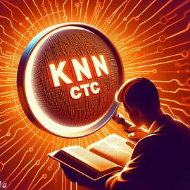

<div align=center>
    
</div>

<h1 align=center>
KNN-CTC: Enhancing ASR via Retrieval of CTC Pseudo Labels
</h1>

This is the offical implemenet of the paper [KNN-CTC: ENHANCING ASR VIA RETRIEVAL OF CTC PSEUDO LABELS](https://arxiv.org/abs/2312.13560)

To get started, follow these steps:


1. Use the provided [recipe](https://github.com/wenet-e2e/wenet/blob/main/examples/aishell/s0/run.sh) from Wenet to download and prepare AISHELL-1 in the `.list` format. Alternatively, you can manually download the AISHELL-1 dataset from [OpenSLR](https://www.openslr.org/33/). The format should adhere to the following structure:

```
{"key": "BAC009S0764W0121", "wav": "/mnt/sda/jiaming_space/datasets/aishell/data_aishell/wav/test/S0764/BAC009S0764W0121.wav", "txt": "甚至出现交易几乎停滞的情况"}
{"key": "BAC009S0764W0122", "wav": "/mnt/sda/jiaming_space/datasets/aishell/data_aishell/wav/test/S0764/BAC009S0764W0122.wav", "txt": "一二线城市虽然也处于调整中"}
{"key": "BAC009S0764W0123", "wav": "/mnt/sda/jiaming_space/datasets/aishell/data_aishell/wav/test/S0764/BAC009S0764W0123.wav", "txt": "但因为聚集了过多公共资源"}
```

2. Download the AISHELL-1 checkpoint from [wenet_pretrain_models](https://github.com/wenet-e2e/wenet/blob/main/docs/pretrained_models.md)

Once the data is prepared, you can run the in-domain KNN-CTC on AISHELL-1 using the following script:

```
# for knn-CTC (pruned)
bash knn_run_aishell-1.sh --stage 1 --stop-stage 2 --lmbda 0.5 --use_null_mask True --decode_skip_blank True --dstore_size 1798000

# for knn-CTC (full)
bash knn_run_aishell-1.sh --stage 1 --stop-stage 2 --lmbda 0.4 --use_null_mask Fasle --decode_skip_blank False --dstore_size 13000000
```

## Dependencies
This project relies on the following open-source frameworks:
- Wenet: [Link](https://github.com/wenet-e2e/wenet)
- knn-transformers: [Link](https://github.com/neulab/knn-transformers)

## Acknowledgements
Special thanks to the developers and contributors of Wenet and knn-transformers for their incredible work and dedication.


##  📚 Cite me
```
@INPROCEEDINGS{10447075,
  author={Zhou, Jiaming and Zhao, Shiwan and Liu, Yaqi and Zeng, Wenjia and Chen, Yong and Qin, Yong},
  booktitle={ICASSP 2024 - 2024 IEEE International Conference on Acoustics, Speech and Signal Processing (ICASSP)}, 
  title={KNN-CTC: Enhancing ASR via Retrieval of CTC Pseudo Labels}, 
  year={2024},
  volume={},
  number={},
  pages={11006-11010},
  keywords={Codes;Signal processing;Natural language processing;Acoustics;Speech processing;Task analysis;Automatic speech recognition;speech recognition;CTC;retrieval-augmented method;datastore construction},
  doi={10.1109/ICASSP48485.2024.10447075}}
``` 